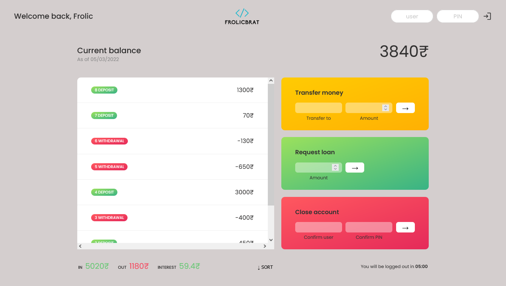

# ApnaBank_project_Javascript

ApnaBank App made using HTML5, CSS3 and Javascript.

### Users should be able to:
  - Login to his/her Account.
  - Send money to different accounts.
  - Request money as a loan.
  - Able to close the account if not in use. 

### ScreenShot :

### Links :

### What I learned.
-Through this project i learned the concept of Map(), Filter(), and Reduce() Functions in Javascript.
 To help u understand the above functions refer to this meme code from twitter
 
All About Map/filter/reduce :

map([🌽, 🐮, 🐔], cook) // Here New Array is formed as per the use of every element of the array element.
=> [🍿, 🍔, 🍳]

filter([🍿, 🍔, 🍳], isVegetarian) // Here the filter function is used to get the desired output. As per the (isVegetarian) condition.
=>  [🍿, 🍳]

reduce([🍿, 🍳], eat) // At last this is what happend when reduce is called 
=> 💩
